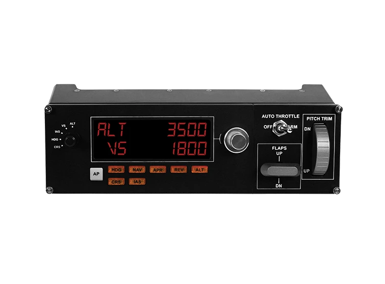

# Configuration Logitech G Saitek Pro Flight Radio Panel


Configuration radio and multi panel based on object.
```
MULTI <ID> <AP_MODE> MODE <AP_OBJECT_TYPE>
```

## ID
* ```-1``` - This configuration for all panel
* ```0``` - First panel as found.
* ```1``` - Second panel as found.
Order panel by usb address based on nuber usb port.

## AP_MODE
* `ALT`
* `VS`
* `IAS`
* `HDG`
* `CRS`

## AP_OBJECT_TYPE
* `off`
* `next`
* `if`
* `add`
* `copy`
* `quad`
* `command`
* `display`
* `radio`
* `list`

## off
Set power off panel state.
```
MULTI -1 <MODE_ID> MODE off
MULTI -1 <MODE_ID> MODE off()
```

## next
Use predefine object
```
MULTI -1 <MODE_ID> MODE next(<NEW_MODE_ID>)
MULTI -1 <NEW_MODE_ID> MODE <NEW_MODE_TYPE>
```

## if
```
MULTI <ID> <MODE> MODE if(<RANGE>)
MULTI <ID> <MODE>[T] MODE <MODE_IF_TRUE>
MULTI <ID> <MODE>[F] MODE <MODE_IF_FALSE>
```

## add
```
TODO LOW DOCS
```

## copy
```
TODO LOW DOCS
```

## quad
```
TODO LOW DOCS
```

## command
```
TODO LOW DOCS
```

## display
```
TODO LOW DOCS
```

## radio
```
TODO LOW DOCS
```

## list
```
TODO LOW DOCS
```

