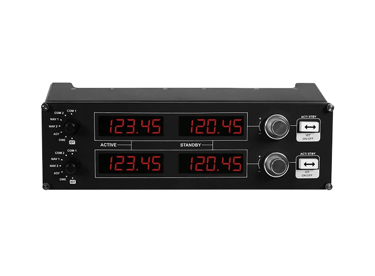

# Configuration Logitech Saitek Pro Flight Multi Panel


Configuration radio and multi panel based on object.
```
RADIO <ID> <RADIO_MODE> MODE <RADIO_OBEJECT_TYPE>
```

## Description of values

### ID
* ```-1``` - This configuration for all panel
* ```0``` - First panel as found.
* ```1``` - Second panel as found.
Order panel by usb address based on nuber usb port.

### RADIO_MODE
* `COM1`
* `COM2`
* `NAV1`
* `NAV2`
* `ADF`
* `DME`
* `XPDR`

### RADIO_OBEJECT_TYPE
* `off`
* `next`
* `if`
* `default`
* `dual`
* `add`
* `value`
* `timeout`
* `show`
* `command`
* `hold`
* `push`
* `exec`
* `list`

### DISPLAY
* `INT`
* `FLOAT`
* `SHORT`
* `<DISPLAY>/<N>`

# Explanation

## Object categori

| 2-DISPLAY | SINGLE    | OPERATION | EXECUTER |
| --------- | --------- | --------- | -------- |
| `default` | `value`   | `next`    | `hold`   |
| `off`     | `show`    | `if`      | `push`   |
|           | `command` | `dual`    | `exec`   |
|           |           | `add`     |          |
|           |           | `timeout` |          |
|           |           | `list`    |          |

* 2-Display mode 
Set all mode as is.

* SINGLE Single mode.
Sets only one display.
This display is the final element of the tree.
He is responsible for outputting information.
And also how to react to pressing buttons or rotating disks.
This mode is single and for a full-fledged mode requires additional operations.
The most common is the add mode.
It makes two displays from two different objects at the same time.

* OPERATION
These elements are not full-fledged elements with information output.
To be precise, these elements do not display information at all.
They only build a dynamic tree of operations.
The panel switches from one mode to another, which creates dynamic changes in the operation of the panel.
Different operations are responsible for different modes.
It is from these operating modes that a dynamic mode change is built.
All modes are built exclusively on the basis of business logic and the desire to obtain a certain result.

* EXECUTER
These elements are not full-fledged elements with information output. 
These modes execute certain commands in the specified types of operations.

## Display
The display is used to assign as a value output.
Depending on the type of values, we need to display it differently
For example if we have a height we output it as a number(INT).
If we have a frequency we can output a number with two fractions (FLOAT)

# Possibility

## next
Use predefine object
```
RADIO -1 <MODE_ID> MODE next(<NEW_MODE_ID>)
RADinIO -1 <NEW_MODE_ID> MODE <NEW_MODE_TYPE>
```

## default
```
RADIO -1 <MODE> MODE default(<DISPLAY>)
RADIO -1 <MODE> VALUE1 <VALUE-LEFT>
RADIO -1 <MODE> VALUE2 <VALUE-RIGHT>
RADIO -1 <MODE> SMALLDOWN <COMMAND_ID_SMALL_UP>
RADIO -1 <MODE> SMALLUP <COMMAND_ID_SMALL_DOWN>
RADIO -1 <MODE> BIGDOWN <COMMAND_ID_BIG_DOWN>
RADIO -1 <MODE> BIGUP <COMMAND_ID_BIG_UP>
RADIO -1 <MODE> ACT <COMMAND_ID_ACT>
```
Example
```
RADIO -1 COM1 MODE default(FLOAT/1000)
RADIO -1 COM1 VALUE1 dataref(sim/cockpit2/radios/actuators/com1_frequency_hz_833)
RADIO -1 COM1 VALUE2 dataref(sim/cockpit2/radios/actuators/com1_standby_frequency_hz_833)
RADIO -1 COM1 SMALLDOWN sim/radios/stby_com1_fine_down
RADIO -1 COM1 SMALLUP sim/radios/stby_com1_fine_up
RADIO -1 COM1 BIGDOWN sim/radios/stby_com1_coarse_down
RADIO -1 COM1 BIGUP sim/radios/stby_com1_coarse_up
RADIO -1 COM1 ACT sim/radios/com1_standy_flip
```

## command
```
RADIO -1 <MODE> MODE command(<DISPLAY>)
RADIO -1 <MODE> VALUE <VALUE>
RADIO -1 <MODE> SMALLDOWN <COMMAND_ID_SMALL_UP>
RADIO -1 <MODE> SMALLUP <COMMAND_ID_SMALL_UP>
RADIO -1 <MODE> BIGDOWN <COMMAND_ID_BIG_DOWN>
RADIO -1 <MODE> BIGUP <COMMAND_ID_BIG_UP>
```
Example
```
RADIO -1 XPDR MODE command(INT)
RADIO -1 XPDR VALUE dataref(sim/cockpit/radios/transponder_code)
RADIO -1 XPDR SMALLDOWN sim/transponder/transponder_34_down
RADIO -1 XPDR SMALLUP sim/transponder/transponder_34_up
RADIO -1 XPDR BIGDOWN sim/transponder/transponder_12_down
RADIO -1 XPDR BIGUP sim/transponder/transponder_12_up
```

## show
```
RADIO -1 <MODE> MODE show(<DISPLAY>)
RADIO -1 <MODE> VALUE <VALUE>
```
Example
```
RADIO -1 nav1-mag MODE show(MINT)
RADIO -1 nav1-mag VALUE dataref(sim/cockpit2/radios/indicators/nav1_bearing_deg_mag)
```

## value
```
RADIO -1 <MODE> MODE value(<SMALL>,<BIG>,<MIN>,<MAX>,(LIMIT|ROUND),<DISPLAY>)
RADIO -1 <MODE> VALUE <VALUE>
```
Example
```
RADIO -1 altitude MODE value(100,1000,1000,40000,LIMIT,INT)
RADIO -1 altitude VALUE dataref(sim/cockpit/autopilot/altitude)
```

## if
```
RADIO <ID> <MODE> MODE if(<RANGE>)
RADIO <ID> <MODE>[T] MODE <MODE_IF_TRUE>
RADIO <ID> <MODE>[F] MODE <MODE_IF_FALSE>
```

## dual
```
RADIO -1 <MODE> MODE dual(<INT_TIMEOUT_SECCOND>)
RADIO -1 <MODE>[0] MODE <NEW_MODE_ONE>
RADIO -1 <MODE>[1] MODE <NEW_MODE_TOO>
```
Example
```
RADIO -1 com2[T] MODE dual(2)
RADIO -1 com2[T][0] MODE next(com1-freq)
RADIO -1 com2[T][1] MODE next(com2-freq)
```

## add
```
RADIO -1 <MODE> MODE add()
RADIO -1 <MODE>[0] MODE <LEFT_MODE>
RADIO -1 <MODE>[1] MODE <RIGHT_MODE>
```
Example
```
RADIO -1 dme MODE add()
RADIO -1 dme[0] MODE next(com2-baro1)
RADIO -1 dme[1] MODE next(com2-baro2)
```

## timeout
```
RADIO -1 <MODE> MODE timeout(<INT_TIMEOUT_SECCOND>)
RADIO -1 <MODE>[0] MODE <MODE_DEFAULT>
RADIO -1 <MODE>[1] MODE <MODE_AFTER_TIMEOUT>
```
Example
```
RADIO -1 nav1 MODE timeout(7)
RADIO -1 nav1[0] MODE next(nav1-freq)
RADIO -1 nav1[1] MODE next(nav1-freqz-dme1)
```

## list
```
RADIO -1 <MODE> MODE list(<COMMAND_ID>)
RADIO -1 <MODE>[0] MODE <NEXT_MODE>
RADIO -1 <MODE>[1] MODE <NEXT_MODE>
RADIO -1 <MODE>[2] MODE <NEXT_MODE>
RADIO -1 <MODE>[3] MODE <NEXT_MODE>
RADIO -1 <MODE>[4] MODE <NEXT_MODE>
```

## hold
```
RADIO -1 <MODE> MODE hold(<COMMAND_ID>,<INT_TIMEOUT_SECCOND>)
RADIO -1 <MODE>[0] MODE <NEXT_MODE>
```

## push
```
RADIO -1 <MODE> MODE push(<COMMAND_ID>)
RADIO -1 <MODE>[0] MODE <NEXT_MODE>
```

## exec
```
RADIO -1 <MODE> MODE exec(<COMMAND_ID>)
RADIO -1 <MODE>[0] MODE <NEXT_MODE>
```

