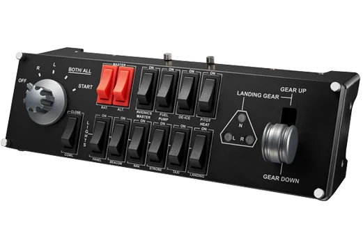

## Configure Logitech G Saitek Pro Flight Switch Panel


Configuration for LED
```
SWITCH <ID> [LEFT|CENTER|RIGHT] <COLOR> <RANGE>
SWITCH <ID> [LEFT|CENTER|RIGHT] NAME <NAME>
```
Configuration for Button
```
SWITCH <ID> <BUTTON> <MODE> <ACTION>
SWITCH <ID> <BUTTON> NAME <NAME>
```
* `COLOR`/`RANGE` read docs for configure ```Saitek Pro Flight Backlit Information Panel```
* `BUTTON` - Name for button
* `MODE` - Type action for mode
* `ACTION` - Action for type
* `NAME` - Name device on virtual panel (0.4.0)

### ID
* ```-1``` - This configuration for all panel
* ```0``` - First panel as found.
* ```1``` - Second panel as found.
Order panel by usb address based on nuber usb port.

### COLOR/RANGE
Read docs for configure ```Saitek Pro Flight Backlit Information Panel```

### BUTTON
Support buttons
* `MAG_OFF`
* `MAG_RIGHT`
* `MAG_LEFT`
* `MAG_BOTH`
* `ENG_START`

* `MASTER_BATTERY`
* `MASTER_ALTENATOR`

* `AVIONICS_POWER`
* `FUEL_PUMP`
* `DE_ICE`
* `PITOT_HEAT`

* `COWL_FLAPS`

* `PANEL_LIGHTS`
* `BEACON_LIGHTS`
* `NAV_LIGHTS`
* `STROBE_LIGHTS`
* `TAXI_LIGHTS`
* `LANDING_LIGHTS`

* `GEAR_SWITCH_UP`
* `GEAR_SWITCH_DOWN`

### MODE 
mode `ON` or `OFF` OR `CMD` - when executed command
* `ON` - exec only when push on button
* `OFF` - exec only when release on button
* `CMD` - exec when push and release button

### ACTION
Action support 
* `command` 
* `set` 
* `push`
* `inc`
* `runif`

### command()
This is main componet swith panel. 
When the panel triggers an event.
It sends a special action identifier to the game.
Recomendation search on this site command id
https://www.siminnovations.com/xplane/command/

For example 
```
SWITCH 0 PITOT_HEAT ON command(sim/ice/pitot_heat0_on)
SWITCH 0 PITOT_HEAT OFF command(sim/ice/pitot_heat0_off)
```
In this example, the driver monitors the status of the button.
If the button is switched on, the heating system is switched on accordingly.
If the button is switched off, the command to switch off the heating system is sent accordingly.

### set()
```
SWITCH <ID> <BUTTON> <MODE> set(dataref(<DATAREF_ID>):=<VALUE>)
SWITCH <ID> <BUTTON> <MODE> set(array(<DATAREF_ID>[<INDEX>]):=<VALUE>)
```
This method allows you to change the values of variables in the game.
You can find the list variables at the following link.
https://developer.x-plane.com/datarefs/

WARNING.
You should always keep track of the types of variables.
* If type float - you mast use dataref
* If type int - you mast use dataref
* If type float[8] - you mast use array
* If type int[50] - you mast use array.

For example 
```
SWITCH 0 GEAR_SWITCH_UP ON set(dataref(sim/cockpit2/controls/parking_brake_ratio):=0.000000)
SWITCH 0 GEAR_SWITCH_DOWN ON set(dataref(sim/cockpit2/controls/parking_brake_ratio):=1.000000)
```
In this example, the driver monitors the state of the button.
If the button is on, the parking brake is applied accordingly.
If the button is off, a command to hide the parking brake is sent accordingly.

### push
```
SWITCH <ID> <BUTTON> CMD push(<COMMAND_ID>)
```
Action `set` or `command` send command only once.
Action push send command status push and hold in this status.

Limitation 
* `push` requires mode `CMD`

For example
```
SWITCH 0 ENG_START CMD push(sim/ignition/ignition_up_1)
```
This command doesn't just give a start command.
She still supports this team in this status.
In our example, we give the command ignition.
It is served more than once. 
This status is maintained until the engine starts.
І shutdown ignition onli if you release it according to the procedure.

### runif
This action for single command action via toggle command or manual failover button.
```
<PANEL_TYPE> <ID> <BUTTON> <MODE> runif(<ACTION>?<RANGE>)
```

Example
```
SWITCH 1 BEACON_LIGHTS OFF runif(command(laminar/b58/lighting/flood_light_switch)?dataref(laminar/b58/flood_light_toggle/switch_pos){1:1})
SWITCH 1 BEACON_LIGHTS ON runif(command(laminar/b58/lighting/flood_light_switch)?dataref(laminar/b58/flood_light_toggle/switch_pos){0:0})
```

### inc
This recomendet for only rotation action.
```
<PANEL_TYPE> <ID> <BUTTON> CMD inc(<VALUE>{<MIN>:<MAX>}/<DELTA>)
```

Limitation 
* `inc` requires mode `CMD`

For expample
```
MULTI -1 ALT[TRIM] CMD  inc(dataref(sim/cockpit2/controls/elevator_trim){-1:1}/-0.01)
```


### Exmaple

For cessna 172
```
SWITCH 0 MAG_OFF ON command(sim/magnetos/magnetos_off)
SWITCH 0 MAG_RIGHT ON command(sim/magnetos/magnetos_right_1)
SWITCH 0 MAG_LEFT ON command(sim/magnetos/magnetos_left_1)
SWITCH 0 MAG_BOTH ON command(sim/magnetos/magnetos_both_1)
SWITCH 0 ENG_START CMD push(sim/ignition/ignition_up_1)

SWITCH 0 GEAR_SWITCH_UP ON set(dataref(sim/cockpit2/controls/parking_brake_ratio):=0.000000)
SWITCH 0 GEAR_SWITCH_DOWN ON set(dataref(sim/cockpit2/controls/parking_brake_ratio):=1.000000)

SWITCH 1 PANEL_LIGHTS CMD push(sim/annunciator/test_all_annunciators)

# Multiple Action for one button
SWITCH 0 PITOT_HEAT ON command(sim/ice/pitot_heat0_on)
SWITCH 0 PITOT_HEAT OFF command(sim/ice/pitot_heat0_off)
SWITCH 0 PITOT_HEAT ON command(sim/ice/pitot_heat1_on)
SWITCH 0 PITOT_HEAT OFF command(sim/ice/pitot_heat1_off)

```
